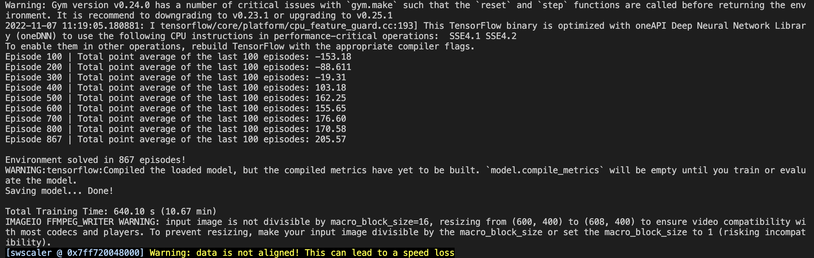
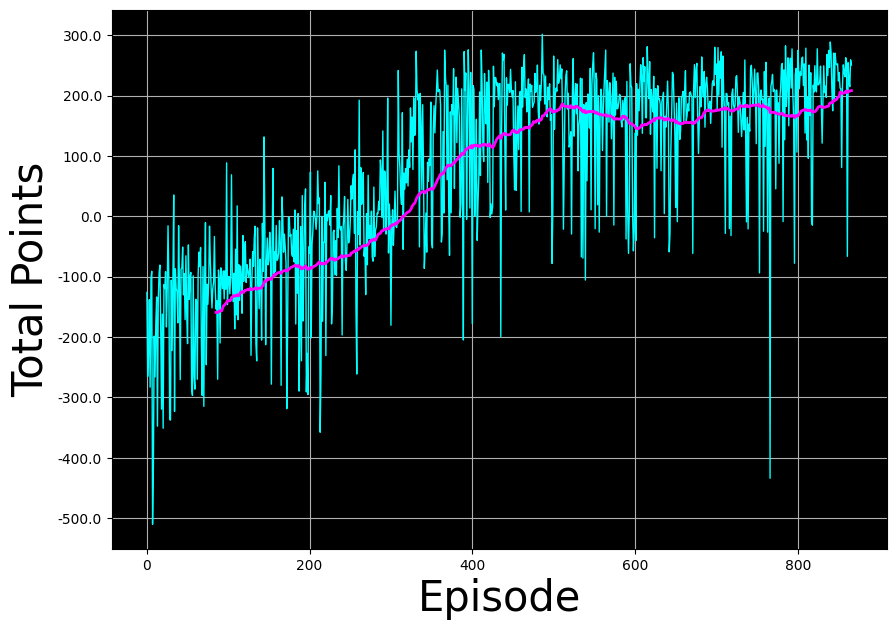

# Solving Lunar Lander Environment using Deep Q-Learning Algorithm with Experience Replay
Task: Training an agent to land a lunar lander safely on a landing pad on the surface of the moon.
## The Lunar Lander Environment

Lunar Lander is one of the environments in [Open AI's Gym library](https://www.gymlibrary.dev/). Simply put, an environment represents a problem or task to be solved. In this case, we will try to solve the environment using Deep Q-Learning Algorithm with Experience Replay.

The landing pad is designated by two flag poles and it is always at coordinates $(0,0)$ but the lander is also allowed to land outside of the landing pad. The lander starts at the top center of the environment with a random initial force applied to its center of mass and has infinite fuel. The environment is considered <b>solved</b> if you get at least $200$ points.

    

<i>Lunar Lander Environment.</i>

### Action Space
The agent has four discrete actions:
- Do nothing (integer $0$).
- Fire left engine (integer $1$).
- Fire main engine (integer $2$).
- Fire right engine (integer $3$).

### Observation Space
A state vector of the agent has $8$ variables:
- The first $2$ variables are $(x, y)$ coordinates of the lander. The landing pad is always at coordinates $(0,0)$.
- The lander's linear velocities $(\dot x,\dot y)$.
- Its angle $\theta$.
- Its angular velocity $\dot \theta$.
- Two booleans, $l$ and $r$, that represent whether each leg is in contact with the ground or not.

### Rewards
- Landing on the landing pad and coming to rest is about $100-140$ points.
- If the lander moves away from the landing pad, it loses reward. 
- If the lander crashes, it receives $-100$ points.
- If the lander comes to rest, it receives $+100$ points.
- Each leg with ground contact is $+10$ points.
- Firing the main engine is $-0.3$ points each frame.
- Firing the side engine is $-0.03$ points each frame.

### Episode Termination
An episode ends (i.e. the environment is in a terminal state) if:
- The lunar lander crashes (i.e if the body of the lunar lander comes in contact with the surface of the moon).
- The absolute value of the lander's $x$-coordinate is greater than $1$ (i.e. it goes beyond the left or right border)

## Interacting with the Gym Environment
Gym implements the classic "agent-environment loop”. An agent interacts with the environment in discrete time steps $t = 0,1,2,...$. At each time step $t$, the agent uses a policy $\pi$ to select an action $A_t$ based on its observation of the environment's state $S_t$. The agent receives a numerical reward $R_t$ and on the next time step, moves to a new state $S_{t+1}$.

<i>Agent-Environment Loop Formalism.</i>

## Deep Q-Learning
We denote that $Q^*(s,a)$ is the optimal action-value function of $Q(s,a)$. In this case, the state space is continuous so it is practically
impossible to explore the entire state-action space. Consequently, this also makes it practically impossible to gradually estimate $Q(s,a)$ until it converges to $Q^*(s,a)$.

In the Deep $Q$-Learning, we solve this problem by using a neural network to estimate the action-value function $Q(s,a)\approx Q^*(s,a)$. We call this neural network a $Q$-Network and it can be trained by adjusting its weights at each iteration to minimize the mean-squared error in the Bellman equation. Here is the Bellman equation:
$$Q(s, a) = R(s) + \gamma \max_{a'} Q(s', a')$$
There's a couple of techniques that can be employed to avoid instabilities when using neural networks in reinforcement learning to estimate action-value functions. These techniques consist of using a ***Target Network*** and ***Experience Replay***. We will explore these two techniques in the following sections.

### Target Network
We can train the $Q$-Network by adjusting its weights at each iteration to minimize the mean-squared error in the Bellman equation, where the target values are given by:

$$
y = R + \gamma \max_{a'}Q(s',a';w)
$$

where $w$ are the weights of the $Q$-Network. This means that we are adjusting the weights $w$ at each iteration to minimize the following error:

$$
\overbrace{\underbrace{R + \gamma \max_{a'}Q(s',a'; w)}_{\rm {y~target}} - Q(s,a;w)}^{\rm {Error}}
$$

Notice that this forms a problem because the $y$ target is changing on every iteration. Having a constantly moving target can lead to oscillations and instabilities. To avoid this, we can create
a separate neural network for generating the $y$ targets. We call this separate neural network the **target $\hat Q$-Network** and it will have the same architecture as the original $Q$-Network. By using the target $\hat Q$-Network, the above error becomes:

$$
\overbrace{\underbrace{R + \gamma \max_{a'}\hat{Q}(s',a'; w^-)}_{\rm {y~target}} - Q(s,a;w)}^{\rm {Error}}
$$

where $w^-$ and $w$ are the weights the target $\hat Q$-Network and $Q$-Network, respectively.

In practice, we will use the following algorithm: every $C$ time steps we will use the $\hat Q$-Network to generate the $y$ targets and update the weights of the target $\hat Q$-Network using the weights of the $Q$-Network. We will update the weights $w^-$ of the the target $\hat Q$-Network using a **soft update**. This means that we will update the weights $w^-$ using the following rule:
 
$$
w^-\leftarrow \tau w + (1 - \tau) w^-
$$

where $\tau\ll 1$. By using the soft update, we are ensuring that the target values, $y$, change slowly, which greatly improves the stability of our learning algorithm.

### Experience Replay
When an agent interacts with the environment, the states, actions, and rewards the agent experiences are sequential by nature. If the agent tries to learn from these consecutive experiences it can run into problems due to the strong correlations between them. To avoid this, we employ a technique known as **Experience Replay** to generate uncorrelated experiences for training our agent. Experience replay consists of: 
- Storing the agent's experiences (i.e the states, actions, and rewards the agent receives) in a memory buffer
- Sampling a random mini-batch of experiences from the buffer to do the learning. 

The experience tuples $(S_t, A_t, R_t, S_{t+1})$ will be added to the memory buffer at each time step as the agent interacts with the environment.

## Deep Q-Learning Algorithm with Experience Replay

 
 
<figure>
  

  
      <figcaption style = "text-align: center; font-style: italic">Deep Q-Learning with Experience Replay.</figcaption>
  

</figure>

## Installation
Run the command `conda create --name <your_env> --file requirements.txt`

## Training
To train the agent, activate the Anaconda environment and run the command `python main.py` in the terminal. The result will look similar to this:
 
 
<figure>
  

  
      <figcaption style = "text-align: center; font-style: italic">Total Training Time.</figcaption>
  

</figure>

You should ignore the warnings in the image above and focus on the main information. This environment is solved in $867$ episodes with the total point average of $205.57$ points ($\geq 200$ points) and the total training time is about $10.67$ minutes

After the training is finished, the model will be saved in `./models/` so we can see the results in `./videos/lunar_lander.mp4` and the moving average of total points through episodes in `./images/moving_average.png`

## Results
 
 
<figure>
  

  
      <figcaption style = "text-align: center; font-style: italic">The Moving Average of Total Points through Episodes.</figcaption>
  

</figure>

https://user-images.githubusercontent.com/53143545/200273404-8717d2b5-3bda-4f7b-a7c1-30cf6936a1e6.mp4

https://user-images.githubusercontent.com/53143545/200273261-cf42491e-15f1-4c72-8615-dc6e0bd2e1a5.mp4

